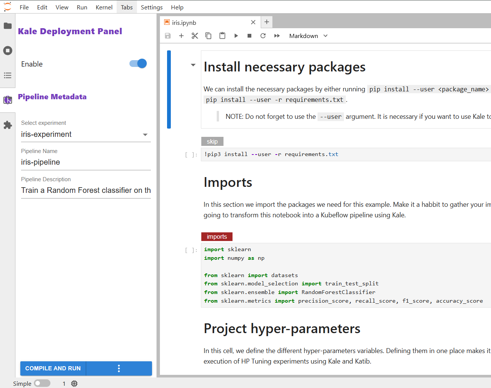

<p align="center">

</p>
<p align="center">
<a href="#">
  
</a>
<a target="_blank" href="https://pypi.org/project/kubeflow-kale/">
    
</a>
<a target="_blank" href="https://www.npmjs.com/package/kubeflow-kale-labextension">
  
</a>
<a target="_blank" href="https://github.com/kubeflow-kale/kale/actions">
  
</a>
</p>

---

> [!NOTE]
> ## Project Status Update 🚀
> 
> After several years of inactivity, we’re excited to announce that Kale development has restarted! 🎉  
> Kale was widely appreciated by the community back in the day, and our current goal is to re-establish a solid baseline by updating all components to the latest versions and ensuring full compatibility with the most recent Kubeflow releases.
> 
> See all details in the [**Road to 2.0 issue**](https://github.com/kubeflow-kale/kale/issues/457)


KALE (Kubeflow Automated pipeLines Engine) is a project that aims at simplifying
the Data Science experience of deploying Kubeflow Pipelines workflows.

Kubeflow is a great platform for orchestrating complex workflows on top of
Kubernetes, and Kubeflow Pipelines provide the means to create reusable components
that can be executed as part of workflows. The self-service nature of Kubeflow
makes it extremely appealing for Data Science use, at it provides an easy access
to advanced distributed jobs orchestration, re-usability of components, Jupyter
Notebooks, rich UIs and more. Still, developing and maintaining Kubeflow
workflows can be hard for data scientists, who may not be experts in working
orchestration platforms and related SDKs. Additionally, data science often
involve processes of data exploration, iterative modelling and interactive
environments (mostly Jupyter notebook).

Kale bridges this gap by providing a simple UI to define Kubeflow Pipelines
workflows directly from your JupyterLab interface, without the need to change a
single line of code.

Read more about Kale and how it works in this Medium post:
[Automating Jupyter Notebook Deployments to Kubeflow Pipelines with Kale](https://medium.com/kubeflow/automating-jupyter-notebook-deployments-to-kubeflow-pipelines-with-kale-a4ede38bea1f)

## Getting started

### Requirements

- Install a Kubernetes cluster (basic Kubernetes cluster, `minikube`, `kind`)
- Install Kubeflow Pipelines(v2.4.0) as recommended in the official documentation [Kubeflow Pipelines Installation](https://www.kubeflow.org/docs/components/pipelines/operator-guides/installation/)

### Installation

Clone the repository:

```bash
git clone https://github.com/kubeflow-kale/kale.git
```

To follow the best practices for coding, create a virtual environment to hold your installation. There are a couple of methods for this.
`conda`:

```bash
cd kale
conda create --name my_project_env python=3.10
conda activate my_project_env
```

`venv`:

```bash
cd kale
python -m venv .venv
source .venv/bin/activate
```

Install the Kale backend from PyPI, and install the JupyterLab extension, `kubeflow-kale-labextension`.

```bash
# activate your virtual environment if you haven't already
conda activate my_project_env
# OR
source .venv/bin/activate

# install jupyter lab
pip install "jupyterlab>=4.0.0"

# install kale
pip install kubeflow-kale

# install the extension
jupyter labextension install kubeflow-kale-labextension
# verify extension status
jupyter labextension list

# run
jupyter lab
```

### Verify backend installation

First, ensure that your `kfp` installation is running. Open a new terminal window and run the following:

```bash
# start your cluster if you haven't already - this example uses minikube
minikube start

# check that the ml-pipeline-persistenceagent and ml-pipeline-ui pods are both running
kubectl get pods -n kubeflow

# start kfp on localhost
kubectl port-forward -n kubeflow svc/ml-pipeline-ui 8080:80
```

Now, when you navigate to the `localhost` url, you should see the KFP UI running with two example pipeline tutorials loaded and ready.
(If the pipelines do not appear, and there is a blue circle "wait" symbol instead, you will need to review the steps for setting up K8s and installing `kfp`.)

Once you have confirmed that the `kfp` install is working as expected, verify that the kale backend has connected to it.
Open a new terminal window and run the following:

```bash
# navigate to the kale/ directory
cd ..

# activate the virtual environment
conda activate my_project_env
# OR
source .venv/bin/activate

# manually call one of the example pipelines to populate in the kfp UI
python ./backend/kale/cli.py --nb ./examples/base/candies_sharing.ipynb --kfp_host http://127.0.0.1:8080 --run_pipeline

# (you can try running the following test, but it is in development and will fail)
pytest -x -vv # TODO
```

The `run-pipeline` command should generate a DSL script in the `root/.kale` directory and create and run a new pipeline called `kale-pipeline`.
Refresh the `kfp` UI browser - you should now see this pipeline.

### Verify frontend installation

Navigate to the JupyterLab window that was opened by the `install` steps. You should see JupyterLab with the Kale icon in the left hand panel.
(You may want to stop and restart the JupyterLab session from the terminal to make sure it is updated with your backend changes from the previous step.)
Click on the Kale icon to open the Kale Deployment Panel - you will only see the title of the panel, and you will not see any of the controls.


In order to see the Kale controls, you must open one of the curated example notebooks from the [examples repository](https://github.com/kubeflow-kale/examples). Navigate to the Files tab and go to `kale/examples/base/`. Choose an `.ipynb` example file and open it. You should now be able to Enable the Kale panel with the toggle and see the controls.



With this Kale Control Panel fully operational, you should be able to start a pipeline run from JupyterLab and see it appear in the `kfp` UI.
Make sure to `Select experiment` (ie. `Kale-Pipeline-Experiment`) and choose a `Pipeline Name` (ie. `candies-sharing`), and then hit `Compile and Run`. You will see progress bars appear. (NOTE: If you do not specify `Select Experiment` and instead let it use the `Default`, you may see the error message `An RPC Error has occurred`.)

Navigate to the `kfp` UI, refresh the page, and check that your new pipeline run has appeared here.

## FAQ

To build images to be used as a NotebookServer in Kubeflow, refer to the
Dockerfile in the `docker` folder.

Head over to [FAQ](FAQ.md) to read about some known issues and some of the
limitations imposed by the Kale data marshalling model.

## Resources

- Kale introduction [blog post](https://medium.com/kubeflow/automating-jupyter-notebook-deployments-to-kubeflow-pipelines-with-kale-a4ede38bea1f)
- Codelabs showcasing Kale working in MiniKF with Arrikto's [Rok](https://www.arrikto.com/):
  - [From Notebook to Kubeflow Pipelines](https://codelabs.developers.google.com/codelabs/cloud-kubeflow-minikf-kale/#0)
  - [From Notebook to Kubeflow Pipelines with HP Tuning](https://arrik.to/demowfhp)
- KubeCon NA Tutorial 2019: [From Notebook to Kubeflow Pipelines: An End-to-End Data Science Workflow](https://kccncna19.sched.com/event/Uaeq/tutorial-from-notebook-to-kubeflow-pipelines-an-end-to-end-data-science-workflow-michelle-casbon-google-stefano-fioravanzo-fondazione-bruno-kessler-ilias-katsakioris-arrikto?iframe=no&w=100%&sidebar=yes&bg=no)
  / [video](http://youtube.com/watch?v=C9rJzTzVzvQ)
- CNCF Webinar 2020: [From Notebook to Kubeflow Pipelines with MiniKF & Kale](https://www.cncf.io/webinars/from-notebook-to-kubeflow-pipelines-with-minikf-kale/)
  / [video](https://www.youtube.com/watch?v=1fX9ZFWkvvs)
- KubeCon EU Tutorial 2020: [From Notebook to Kubeflow Pipelines with HP Tuning: A Data Science Journey](https://kccnceu20.sched.com/event/ZerG/tutorial-from-notebook-to-kubeflow-pipelines-with-hp-tuning-a-data-science-journey-stefano-fioravanzo-ilias-katsakioris-arrikto)
  / [video](https://www.youtube.com/watch?v=QK0NxhyADpM)

## Contribute

Follow these steps to run the extension in developer mode, so you can see and test your changes in real time.
Please note: this functionality is still in development, and there is not a streamlined way to observe code changes as you make them.

#### Backend and Labextension

Make sure you have installed Kubeflow Pipelines(v2.4.0) as recommended in the official documentation [Kubeflow Pipelines Installation](https://www.kubeflow.org/docs/components/pipelines/operator-guides/installation/).

Open a new terminal window for `kale`:

```bash
# checkout to the backend/ directory
cd backend

# activate the virtual environment
conda activate my_project_env
# OR
source .venv/bin/activate

# make sure JupyterLab is installed in the venv
pip install "jupyterlab>=4.0.0"

# install the extension in dev mode
pip install -e .[dev]

# checkout to the labextension/ directory
cd ..
cd labextension

#install the Jupyter extension
pip install -e ".[test]"
```

Open a new terminal window for `kfp`:

```bash
# start kfp locally in another terminal
kubectl port-forward -n kubeflow svc/ml-pipeline-ui 8080:80

# run cli from outside the backend/ directory
cd ..
python ./backend/kale/cli.py --nb ./examples/base/candies_sharing.ipynb --kfp_host http://127.0.0.1:8080 --run_pipeline
```

#### Build and Run Kale in Developer Mode

The JupyterLab Python package comes with its own yarn wrapper, called `jlpm`.

Open a new terminal window to the `kale` directory and run the following:

```bash
# activate the virtual environment
conda activate my_project_env
# OR
source .venv/bin/activate

# make sure you have the correct version of jupyterlab
pip install "jupyterlab>=4.0.0"

# check out the labextension directory
cd labextension/

# build extension
jlpm build

# install dependencies using pyproject.toml
pip install -e . --force-reinstall

# install labextension in dev mode
jupyter labextension develop . --overwrite

# list installed jp extensions
jupyter labextension list
```

Finally, you can run Kale in developer mode

```bash
# move to the base kale directory
cd ..

# open jupyterlab
jupyter lab

# To make changes and rebuild, open 2nd tab of terminal, then
# checkout the labextension/ directory
cd labextension
# rebuild the extension
jlpm build
```

#### Notes to consider

1. Component names can't be same as any other variable with same name being used in the user code.
2. Component name can't have \_ and spaces, but instead have '-'
3. Component names can't have capital letters and numbers after a '-'.
4. Step names shouldn't have capital letters and no numbers after '-', eg. 'kid1' is fine, but not 'kid-1'.
5. Step names with \_ are replaced to '-' for component names and appended with '-step' in the DSL script.
6. Artifact variables are appended with '-artifact' in the DSL script.

#### Git Hooks

This repository uses
[husky](https://github.com/typicode/husky)
to set up git hooks.

For `husky` to function properly, you need to have `yarn` installed and in your
`PATH`. The reason that is required is that `husky` is installed via
`jlpm install` and `jlpm` is a `yarn` wrapper. (Similarly, if it was installed
using the `npm` package manager, then `npm` would have to be in `PATH`.)

Currently installed git hooks:

- `pre-commit`: Run a prettier check on staged files, using
  [pretty-quick](https://github.com/azz/pretty-quick)
